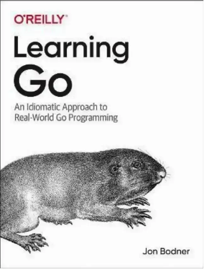

# 📘 Golang Study Notes Archive

This repository is an **archive and collection of tips, notes, and explanations** based on a Go (Golang) learning book.  
It summarizes key concepts, examples, and insights to help understand Go more effectively — from basic syntax to advanced features.

> 🧠 My notes to remember and study Go programming.

